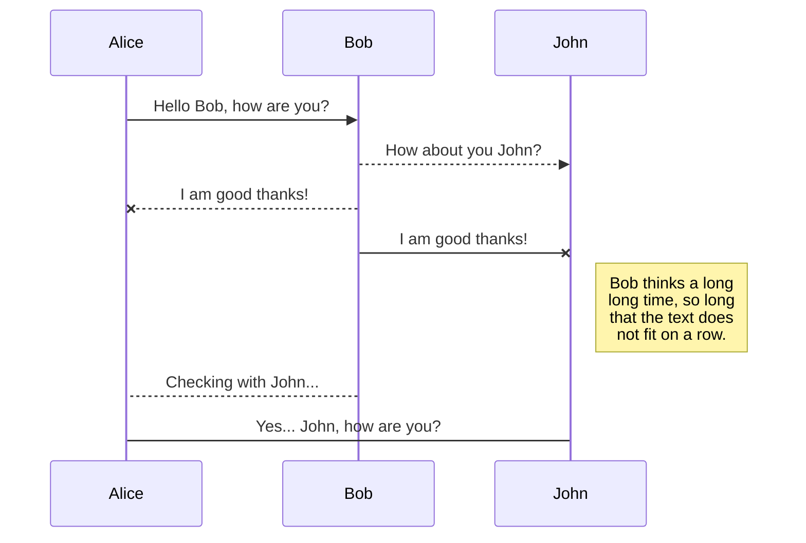
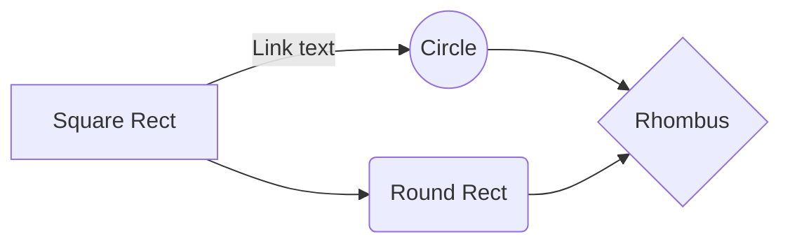

# Real My SQL 6장 실행계획

## **6.3 MySQL의 주요 처리방식**

Hi! I'm your first Markdown file in **StackEdit**. If you want to learn about StackEdit, you can read me. If you want to play with Markdown, you can edit me. Once you have finished with me, you can create new files by opening the **file explorer** on the left corner of the navigation bar.

## 풀 테이블 스캔

StackEdit stores your files in your browser, which means all your files are automatically saved locally and are accessible **offline!**

## ORDER BY 처리

- 소트버퍼(Sort buffter)
   -	MySQL은 정렬을 수행하기 위해 별도의 메모리 공간을 할당 받아서 사용하는데, 이 메모리 공간을 소트 버퍼라고 한다.
   -	소트 버퍼는 정렬이 필요한 경우에만 할당하며, 버퍼의 크기는 정렬해야 할 레코드의 크기에 따라 가변적으로 증가하지만 최대 사용 가능한 소트 버퍼의 공간은 sort_buffer_size라는 시스템 변수로 설정할 수 있다.
- 정렬 알고리즘
   레코드를 정렬할 때, 레코드 전체를 소트버퍼에 담을지 또는 정렬 기준 컬럼만 소트 버퍼에 담을지에 따라 2가지 정렬 알고리즘으로 나눠볼 수 있다.
	 -	싱글 패스 알고리즘
	    소트 버퍼에 정렬 기준 컬럼을 포함해 SELECT 되는 컬럼 전부를 담아서 정렬을 수행하는 방법이다. 정렬 대상 레코드의 크기나 건수가 상당히 작은경우 빠른 성능을 보인다.
	 -	투 패스 알고리즘
	    정렬 대상 컬럼과 프라이머리 키값만을 소트버퍼에 담아서 정렬을 수행하고 정렬된 순서대로 다시 프라이머리 키로 테이블을 읽어서 SELECT 할 컬럼을 가져오는 알고리즘이다. 정렬 대상 레코드의 크기나 건수가 상당히 많은 경우에 효율적이다.

## Group BY 처리

All your files and folders are presented as a tree in the file explorer. You can switch from one to another by clicking a file in the tree.

- The workspace synchronization will sync all your files, folders and settings automatically. This will allow you to fetch your workspace on any other device.
	> To start syncing your workspace, just sign in with Google in the menu.

- The file synchronization will keep one file of the workspace synced with one or multiple files in **Google Drive**, **Dropbox** or **GitHub**.
	> Before starting to sync files, you must link an account in the **Synchronize** sub-menu.

## Open a file

You can open a file from **Google Drive**, **Dropbox** or **GitHub** by opening the **Synchronize** sub-menu and clicking **Open from**. Once opened in the workspace, any modification in the file will be automatically synced.

## Save a file

You can save any file of the workspace to **Google Drive**, **Dropbox** or **GitHub** by opening the **Synchronize** sub-menu and clicking **Save on**. Even if a file in the workspace is already synced, you can save it to another location. StackEdit can sync one file with multiple locations and accounts.

## Synchronize a file

Once your file is linked to a synchronized location, StackEdit will periodically synchronize it by downloading/uploading any modification. A merge will be performed if necessary and conflicts will be resolved.

If you just have modified your file and you want to force syncing, click the **Synchronize now** button in the navigation bar.

> **Note:** The **Synchronize now** button is disabled if you have no file to synchronize.

## Manage file synchronization

Since one file can be synced with multiple locations, you can list and manage synchronized locations by clicking **File synchronization** in the **Synchronize** sub-menu. This allows you to list and remove synchronized locations that are linked to your file.

# Publication

Publishing in StackEdit makes it simple for you to publish online your files. Once you're happy with a file, you can publish it to different hosting platforms like **Blogger**, **Dropbox**, **Gist**, **GitHub**, **Google Drive**, **WordPress** and **Zendesk**. With [Handlebars templates](http://handlebarsjs.com/), you have full control over what you export.

> Before starting to publish, you must link an account in the **Publish** sub-menu.

## Publish a File

You can publish your file by opening the **Publish** sub-menu and by clicking **Publish to**. For some locations, you can choose between the following formats:

- Markdown: publish the Markdown text on a website that can interpret it (**GitHub** for instance),
- HTML: publish the file converted to HTML via a Handlebars template (on a blog for example).

## Update a publication

After publishing, StackEdit keeps your file linked to that publication which makes it easy for you to re-publish it. Once you have modified your file and you want to update your publication, click on the **Publish now** button in the navigation bar.

> **Note:** The **Publish now** button is disabled if your file has not been published yet.

## Manage file publication

Since one file can be published to multiple locations, you can list and manage publish locations by clicking **File publication** in the **Publish** sub-menu. This allows you to list and remove publication locations that are linked to your file.

# Markdown extensions

StackEdit extends the standard Markdown syntax by adding extra **Markdown extensions**, providing you with some nice features.

> **ProTip:** You can disable any **Markdown extension** in the **File properties** dialog.

## SmartyPants

SmartyPants converts ASCII punctuation characters into "smart" typographic punctuation HTML entities. For example:

|                |ASCII                          |HTML                         |
|----------------|-------------------------------|-----------------------------|
|Single backticks|`'Isn't this fun?'`            |'Isn't this fun?'            |
|Quotes          |`"Isn't this fun?"`            |"Isn't this fun?"            |
|Dashes          |`-- is en-dash, --- is em-dash`|-- is en-dash, --- is em-dash|

## KaTeX

You can render LaTeX mathematical expressions using [KaTeX](https://khan.github.io/KaTeX/):

The *Gamma function* satisfying $\Gamma(n) = (n-1)!\quad\forall n\in\mathbb N$ is via the Euler integral

$$
\Gamma(z) = \int_0^\infty t^{z-1}e^{-t}dt\,.
$$

> You can find more information about **LaTeX** mathematical expressions [here](http://meta.math.stackexchange.com/questions/5020/mathjax-basic-tutorial-and-quick-reference).

## UML diagrams

You can render UML diagrams using [Mermaid](https://mermaidjs.github.io/). For example, this will produce a sequence diagram:

And this will produce a flow chart:

